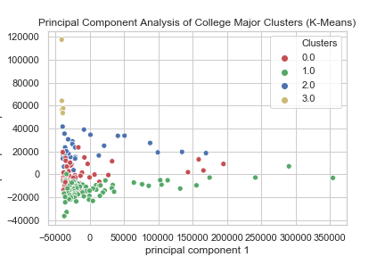

# Clustering College Majors By Economic Outcomes
* Dataset from the data journalism website fivethirtyeight, listing college majors, associated demographic data, and their economic outcomes, especially income and employment
* Data includes only recent BA/BS graduates to get an up-to-date view of current economic outcomes
* Begins by constructing new variables, e.g., share of recent grads working part-time
* Exploratory data analysis with correlations, visualizations, and multiple linear regressions
* Three algorithms (K-Means, KNN, and Hierarchical Clustering) were used to build clusters of majors
* Loops with different validation methods found the optimal number of clusters
* Principal Component Analysis was applied to visualize the two successful models (k-means and Hierarchical Clustering).
* The PCA plot visualizing the k-means model is as follows:

